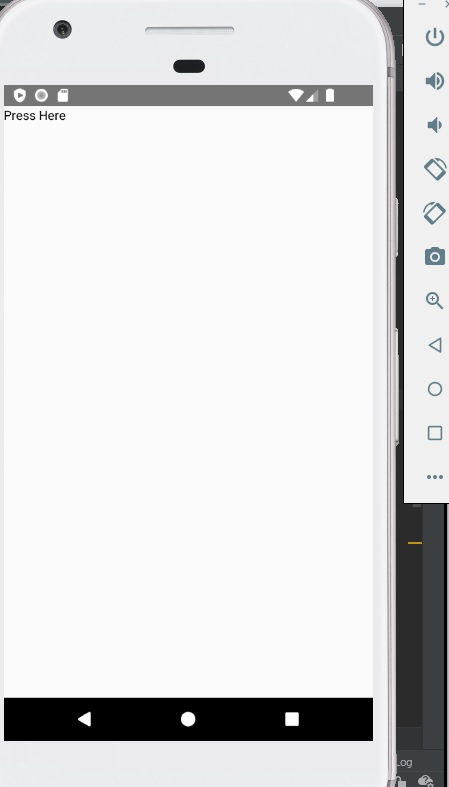

# react-native-native-call-example

Here is an example project for learning React Native /w NativeModules.  
This app demonstrates
* Call Java code from React Native
* Call C code from React Native using JNI

## Prerequisites

* Windows 10
* Already installed below
  * Node.js
  * Yarn
  * Android Studio(Also NDK on your machine)
* Checked /w Android only (API 26 and 30)

## Files you should check

You can find the module(TestReactModule.java) and the package(MyReactPackage.java) for React Native Native Module under 'android/app/src/main/java/com/testapp/module'.  
And also you can find C code and Android.mk / Application.mk for using ndk-build under 'android/app/src/main/jni'.
This app doesn't use React Native autolink feature, so you can see adding the package class into ReactPackage in MainApplication.java.  

## Build

This app use ndk-build for compiling C code. You can see 'externalNativeBuild' block for it in build.gradle.  

## How to run

1. Run AVD from Android Studio.
1. Open a command prompt and go to project folder.
1. Hit the below to run Metro.
    ```bash
    yarn start
    ```
1. Open another prompt and go to project folder.
1. Hit the below to build code and install APK to your AVD.
    ```bash
    yarn android
    ```
1. Now you can see the application  
    
1. Click 'Press Here', then you can find log like the below in Metro Console
    

    ```bash
     LOG  Call From Java using getFromJava method
     LOG  I am C
    ```
    The first log comes from TestReactModule#getFromJava() method.  
    The Second log comes from test_react.c via TestReactModule#getFromCLibrary() method

## Refs

* [React Native Docs: Android Native Modules](https://reactnative.dev/docs/native-modules-android)
* [Blog Entry: Native Modules with JNI&C](https://thebhwgroup.com/blog/react-native-jni)
* [Android DevDocs: NDK](https://developer.android.com/ndk/guides/concepts)
* [Android DevDocs: Add Native code](https://developer.android.com/studio/projects/add-native-code#link-gradle)
* [Android DevDocs: Gradle External Native Builds](https://developer.android.com/studio/projects/gradle-external-native-builds)

## Notice

If you use Android Studio to create/edit your Java code for Native Modules, you should stop Metro before building your Java code using gradle.  
I've faced an issue that APK wasn't updated when sending it to AVD or real devices. It comes up an error like this.  

``` bash
Type Error: <YOUR AWSOME FUNCTION> is not a function. (In '<YOUR AWSOME FUNCTION.YOUR METHOD>' is null)
```

